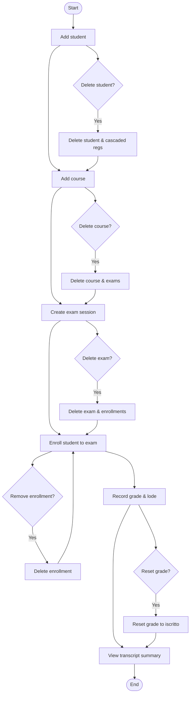

# Activity Diagram

```mermaid
flowchart TD
    A([Start]) --> B[Add student]
    B --> C[Add course]
    C --> D[Create exam session]
    D --> E[Enroll student to exam]
    E --> F[Record grade & lode]
    F --> G[View transcript summary]
    G --> H([End])

    B --> Bd{Delete student?}
    Bd -->|Yes| Bdel[Delete student & cascaded regs] --> C
    C --> Cd{Delete course?}
    Cd -->|Yes| Cdel[Delete course & exams] --> D
    D --> Dd{Delete exam?}
    Dd -->|Yes| Ddel[Delete exam & enrollments] --> E
    E --> Ed{Remove enrollment?}
    Ed -->|Yes| Edel[Delete enrollment] --> E
    F --> Fd{Reset grade?}
    Fd -->|Yes| Fdel[Reset grade to iscritto] --> G
```

