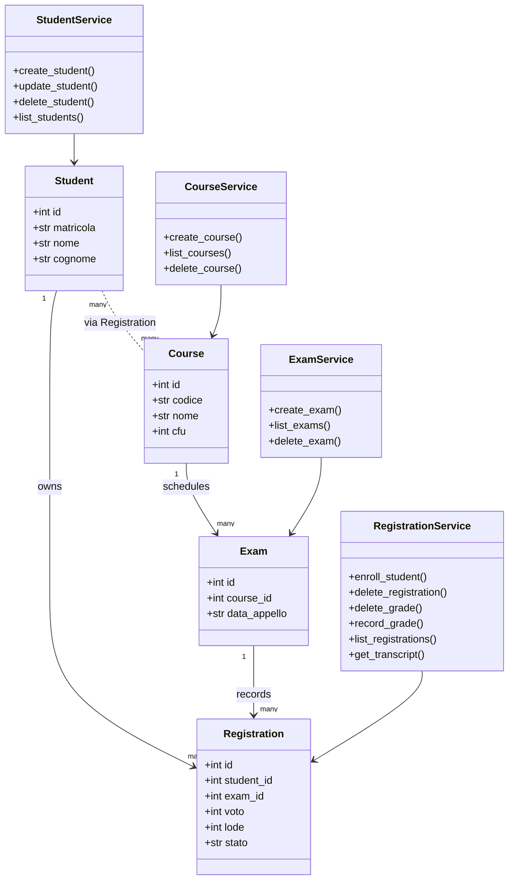

# Class Diagram

```mermaid
classDiagram
    class Student {
        +int id
        +str matricola
        +str nome
        +str cognome
    }
    class Course {
        +int id
        +str codice
        +str nome
        +int cfu
    }
    class Exam {
        +int id
        +int course_id
        +str data_appello
    }
    class Registration {
        +int id
        +int student_id
        +int exam_id
        +int voto
        +int lode
        +str stato
    }
    class StudentService {
        +create_student()
        +update_student()
        +delete_student()
        +list_students()
    }
    class CourseService {
        +create_course()
        +list_courses()
        +delete_course()
    }
    class ExamService {
        +create_exam()
        +list_exams()
        +delete_exam()
    }
    class RegistrationService {
        +enroll_student()
        +delete_registration()
        +delete_grade()
        +record_grade()
        +list_registrations()
        +get_transcript()
    }

    Course "1" --> "many" Exam : schedules
    Student "1" --> "many" Registration : owns
    Exam "1" --> "many" Registration : records
    Student "many" .. "many" Course : via Registration
    StudentService --> Student
    CourseService --> Course
    ExamService --> Exam
    RegistrationService --> Registration
```
