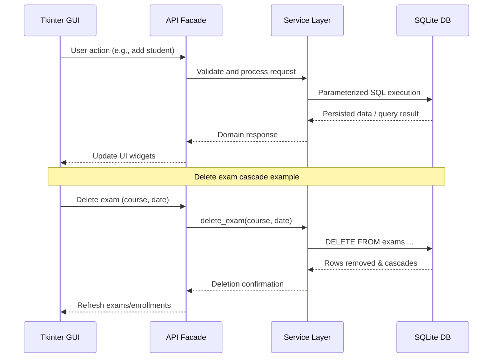

# Sequence Diagram

```mermaid
sequenceDiagram
    participant GUI as Tkinter GUI
    participant API as API Facade
    participant SRV as Service Layer
    participant DB as SQLite DB

    GUI->>API: User action (e.g., add student)
    API->>SRV: Validate and process request
    SRV->>DB: Parameterized SQL execution
    DB-->>SRV: Persisted data / query result
    SRV-->>API: Domain response
    API-->>GUI: Update UI widgets

    Note over GUI,DB: Delete exam cascade example
    GUI->>API: Delete exam (course, date)
    API->>SRV: delete_exam(course, date)
    SRV->>DB: DELETE FROM exams ...
    DB-->>SRV: Rows removed & cascades
    SRV-->>API: Deletion confirmation
    API-->>GUI: Refresh exams/enrollments
```

